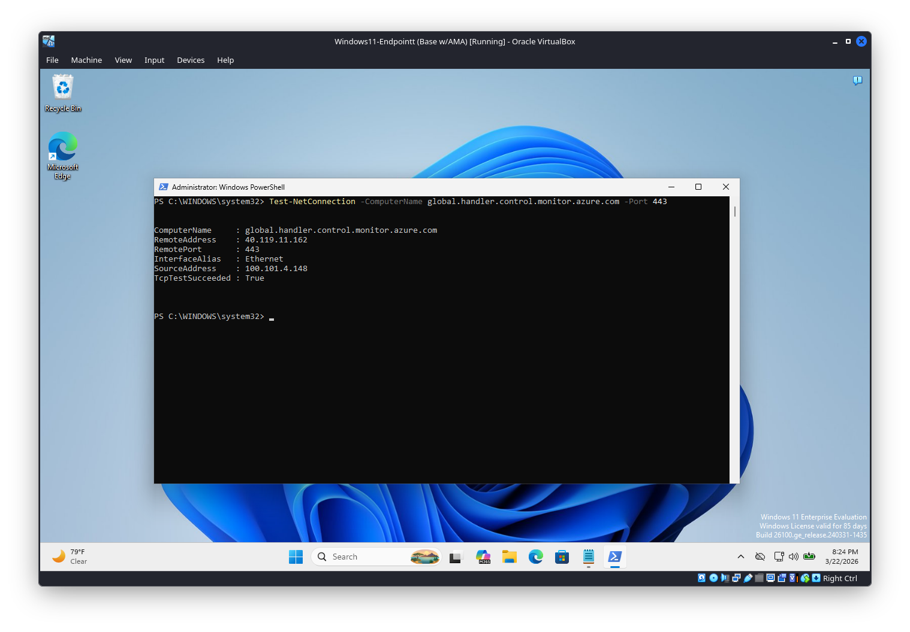
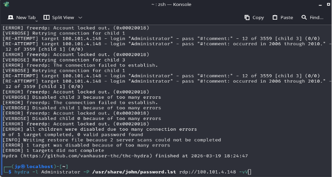
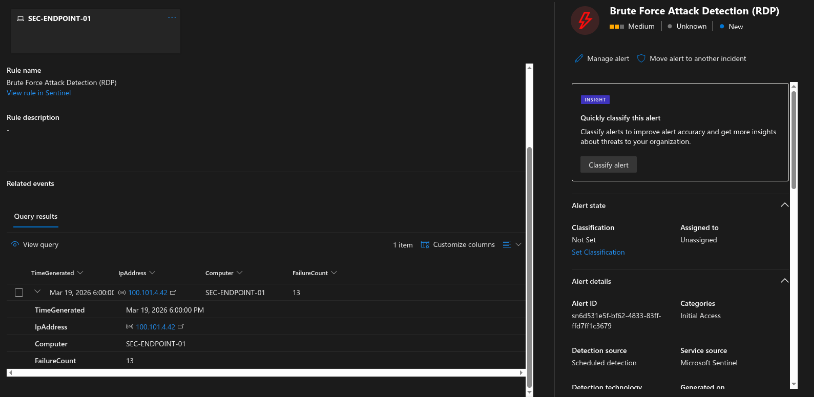
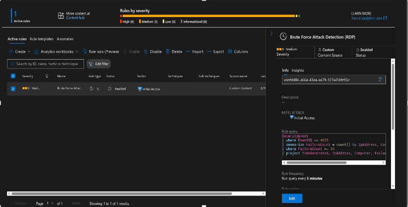
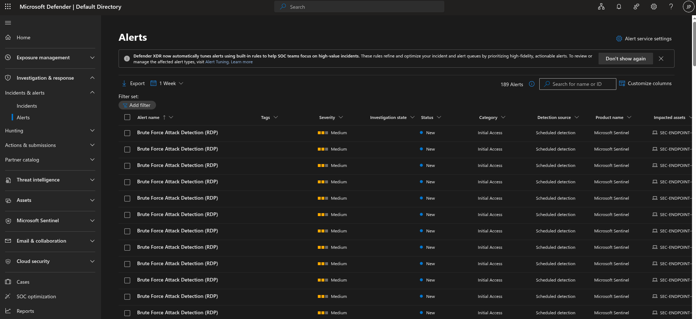

Azure Sentinel SIEM & Brute Force Detection Lab

Project Overview
This project demonstrates the deployment of a Cloud-Native SIEM (Microsoft Sentinel) to monitor and defend a Windows 11 virtual machine. 
I simulated a real-world RDP Brute Force attack using Kali Linux, performed advanced Windows system administration to secure the endpoint, and authored custom KQL Analytics Rules to detect, alert, 
and visualize the intrusion.

Technical Stack
Cloud Provider: Microsoft Azure
SIEM: Microsoft Sentinel
Log Management: Log Analytics Workspace
Endpoint: Windows 11 Enterprise (VirtualBox)
Attacker OS: Kali Linux (VirtualBox)
Attack Tool: Hydra (RDP Brute Force)
Query Language: Kusto Query Language (KQL)

Lab Phases
1. Environment Configuration & Troubleshooting

Challenge: Encountered a closed RDP listener (Port 3389) and an unresponsive Remote Desktop Service.
Action: Used PowerShell to force-enable the RDP registry keys, disable Network Level Authentication (NLA) for testing, and reset the firewall rules.
Outcome: Verified connectivity using Test-NetConnection with a successful TcpTestSucceeded : True result.

2. Simulated Attack (Hydra Brute Force)

Attack Method: Used Hydra on Kali Linux to attempt an RDP credential stuffing attack against the Windows Administrator account.
Defense Triggered: The Windows Account Lockout Policy successfully identified the brute-force attempt.
Evidence: The attack resulted in a "System Error 5: Access Denied" on the Windows host, confirming the local security policy effectively neutralized the threat.

3. SIEM Detection & Analytics

Log Ingestion: Confirmed ingestion of SecurityEvent logs into Azure.
Custom Analytics Rule: Authored a logic rule to monitor for specific Event IDs (4625 - Logon Failure).
Alert Trigger: Successfully generated a Sentinel Incident that mapped the attacker's IP and the target host, providing a centralized dashboard for investigation.

KQL Analytics Logic
The following query was used to create the automated detection rule in Microsoft Sentinel:

Code snippet:
SecurityEvent
| where EventID == 4625
| summarize FailureCount = count() by IpAddress, Computer, bin(TimeGenerated, 5m)
| where FailureCount >= 10
| project TimeGenerated, IpAddress, Computer, FailureCount

Visualizing the Attack
Using Sentinel’s charting capabilities, I visualized the attack "spike," which clearly identifies the volume and frequency of the Hydra brute-force attempt. This visual data is critical for SOC analysts to distinguish between a single forgotten password and an active automated attack.
!(./Brute-Force-Lab/Assets/Screenshot%202026-03-23%20172240.png)

Key Takeaways

Troubleshooting Mastery: Resolved service hangs and registry conflicts to ensure the attack surface was correctly configured for testing.
The "Lockout" Metric: Proved that account lockouts are a vital defense layer and a high-fidelity indicator for SIEM alerting.
End-to-End Visibility: Gained experience in the full incident lifecycle—from reconnaissance and attack to detection and remediation.
